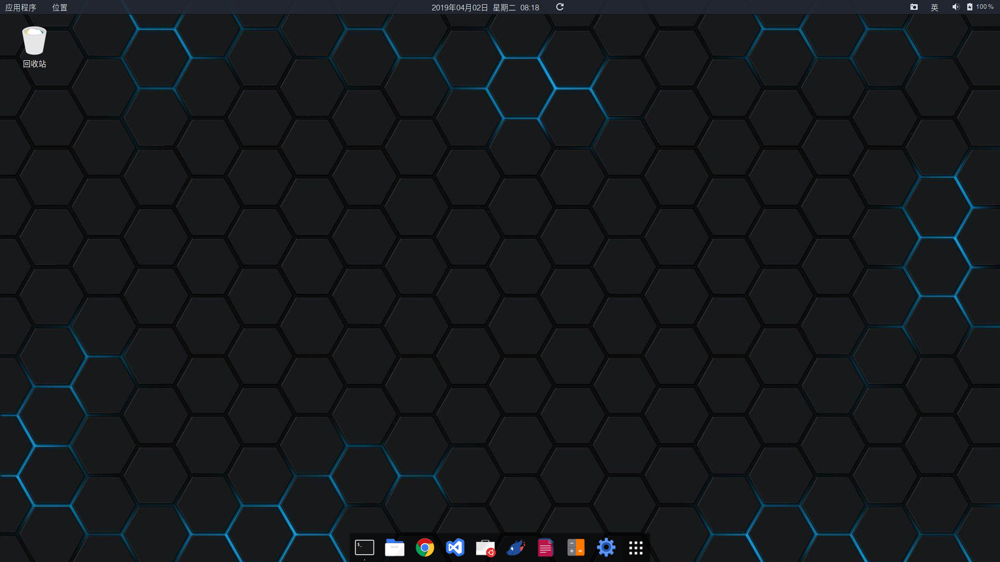

> Ubuntu 18.04安装配置指南.

## 安装配置ubuntu18.04

### 准备材料

> 我的电脑是联想拯救者Y7000，配置i5-8300H, 1050Ti, 8G内存， 512G固态。安装Ubuntu的主要影响是显卡驱动问题会导致安装过程死机，wifi模块默认关闭，安装过程中不能立刻使用无线联网。

* Ubuntu桌面版iso镜像文件，从Ubuntu官网下载：<https://www.ubuntu.com/download/desktop>

* 8G以上U盘

* rufus软件，用于将Ubuntu镜像烧录到U盘

### 安装

1. 使用rufus软件，将下载好的Ubuntu镜像烧录到U盘
1. 重启电脑，选择从USB启动
1. 进入按照启动画面后选择`ubuntu install`，（解决安装过程中的死机问题：按'e'键，将`quiet splash ---`修改为 `quiet splash nomodeset`）
1. 进入图形化安装界面，正常逐步操作
1. 重启后选择`ubuntu`，（解决安装过程中的死机问题：按'e'键，添加：`nomodeset`）

> 重启后基本可以正常使用，但本机wifi不能使用，显卡驱动为装，登录、关机都会出现死机情况，下面在配置部分逐项解决

### 配置

1. 开启无线网卡：

```bash
sudo gedit /etc/modprob.d/ideapad.conf
blacklist ideapad_laptop
sudo touch /etc/modprobe.d/ideapad.conf
sudo modprobe -r ideapad_laptop
```

2. 连接网络后打开软件更新，更新软件

1. 安装显卡驱动：

```bash
nvidia drivers:ubuntu-drivers devices
sudo ubuntu-drivers autoinstall
```

### 美化

> ubuntu18.10开始，Ubuntu默认主题已足够美观，进一步美化可参照以下步骤

1. 安装**ubuntu tweak tool**

1. 安装**gnome-shell**

1. 在gnome-look下载各类主题，安装主题的按照说明进行安装使用

### 我的Ubuntu桌面

*桌面*

 

*打开应用*


可以愉快的使用了，需要什么软件搜索就可以了